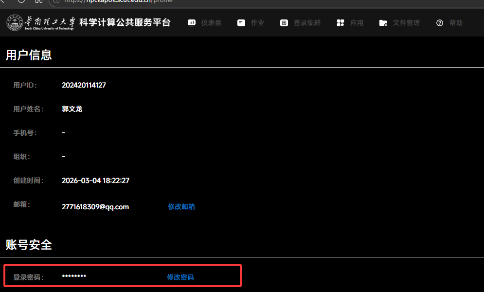
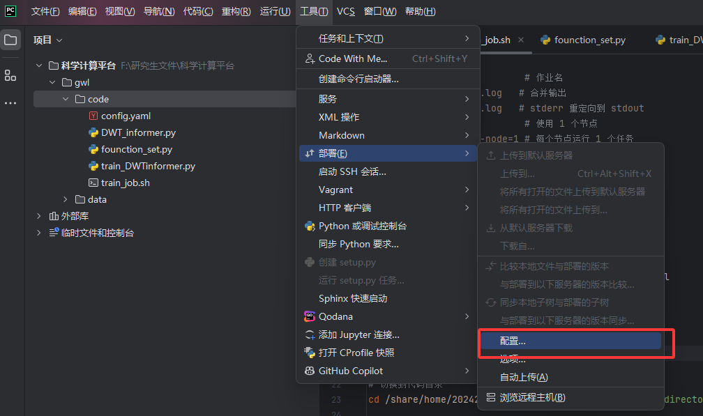
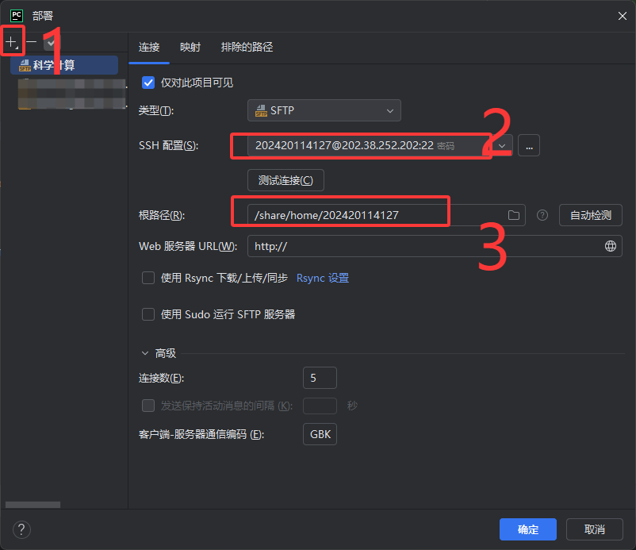
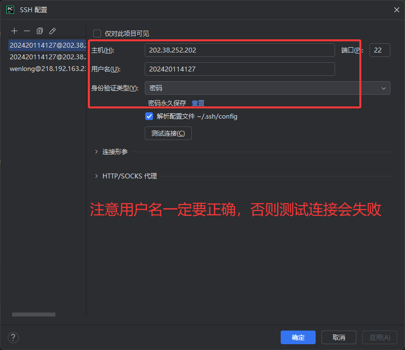
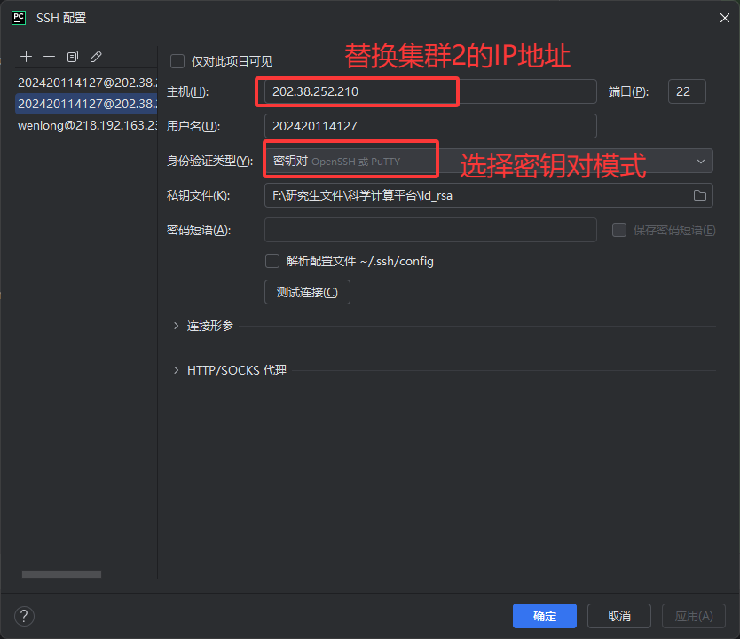
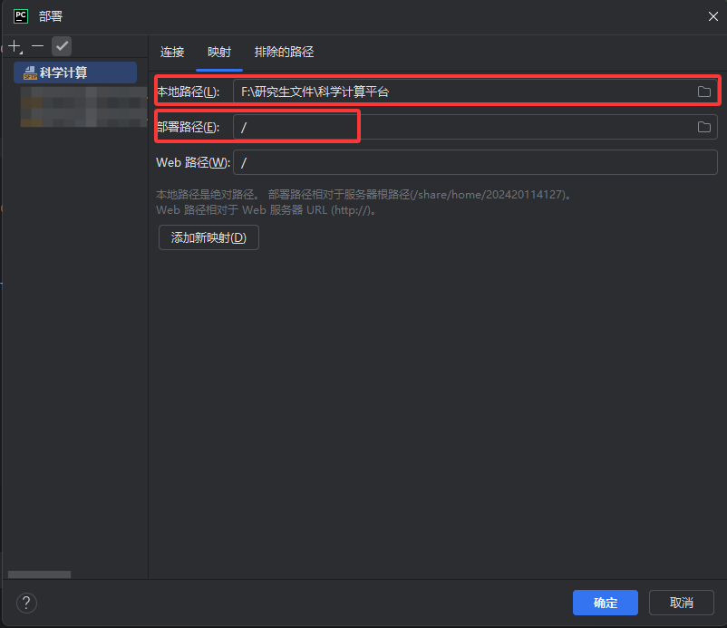
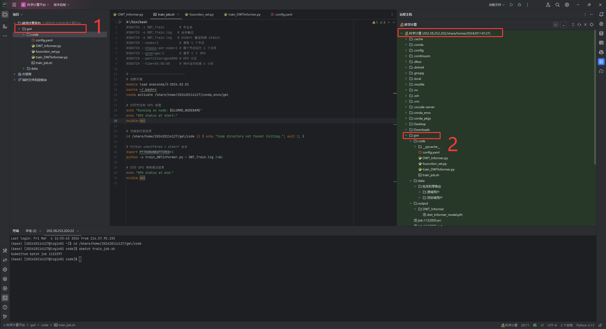
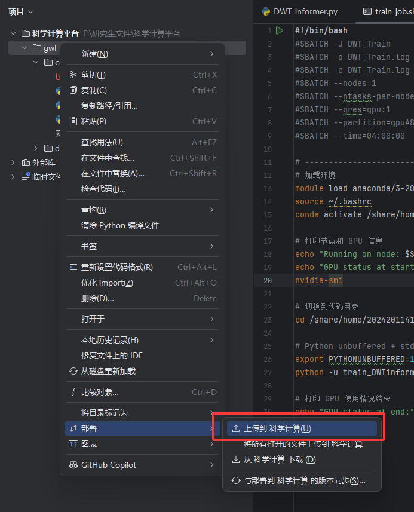
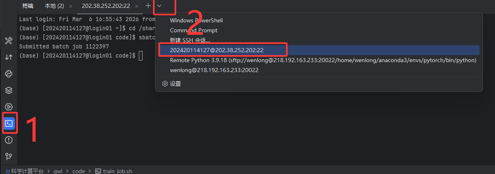

# 华南理工大学科学计算公共服务平台开发流程

> **📝 作者声明**
> 
> **作者**：郭文龙  
> **文档性质**：个人摸索
> 
> 本文档内容基于个人在华南理工大学科学计算平台上的实际配配置经验整理而成，**并非专业教程**，仅供实验室成员参考使用。
> 
> **适用范围**：
> - ✅ 深度学习环境配置（Python、PyTorch、GPU 等）
> - ✅ 本地电脑操作即可，只需终端操作，与实验室服务器使用较为相似，不依赖学校平台界面
> - ✅ HPC 平台基础使用（SSH 连接、作业提交等）
> - ❌ 不涉及规划求解器方面配置
> 
> **使用建议**：
> - 如发现文档中有错误或不当之处，欢迎指出
> - 文档仅覆盖常见的深度学习环境配置场景，其他专业问题请参考：
>   - 💡 使用 ChatGPT、Claude 等 AI 工具咨询
>   - 💡 网络搜索相关解决方案
>   - 💡 查阅华工 HPC 平台官方文档：https://hpc.scut.edu.cn/docs/

> **⚠️ 重要提示：账号共享与文件管理规范**
> 
> **账号情况说明**：
> - 实验室 HPC 账号数量有限（目前共 7 个：陈宗源 董凯元 萧文聪 罗庆全 刘羽彬 郭文龙 王超 ）
> - 所有账号理论上为实验室成员共享
> - 无账号的同学可以向有账号的同学获取账号使用权
> - 如果开始账号设置的密码为自己私密的密码，可以通过如下界面更换普通密码以供多位同学同时使用

---

## 文档说明

本文档面向实验室开发人员，重点整理华南理工大学科学计算公共服务平台上的**深度学习环境配置**流程，包括 Python 环境部署、GPU 版 PyTorch 安装以及 Slurm 作业提交等内容，旨在帮助实验室成员快速上手，减少重复配置成本。

---

## 1. 平台访问与登录

### 1.1 Web 访问

- **主门户（SCOW）**：https://hpckapok.scut.edu.cn
- **集群1门户（hpckapok1）**：https://hpckapok1.scut.edu.cn
- **集群2门户（hpckapok2）**：https://hpckapok2.scut.edu.cn

### 1.2 SSH 访问

#### 集群1（hpckapok1）

- **主机名**：`hpckapok1.scut.edu.cn`
- **IP 地址**：`202.38.252.202`、`202.38.252.203`、`202.38.252.204`、`202.38.252.205`
- **认证方式**：账号密码

#### 集群2（hpckapok2）

- **IP 地址**：`202.38.252.210`、`202.38.252.211`
- **认证方式**：密钥登录（需先登录集群2门户下载密钥）

### 1.3 桌面访问（VNC）

#### 方式一：Web VNC

1. 登录 https://hpckapok.scut.edu.cn
2. 点击"登录集群" → "桌面" → "新建桌面"
3. 点击"启动"（集群1和集群2通用）

#### 方式二：客户端工具

- 使用 MobaXterm 等客户端工具
- 输入 SSH 访问的 IP 地址
- 选择 xfce4 桌面

> **参考文档**：https://hpc.scut.edu.cn/docs/login.html

---

## 2. 本地 IDE 远程连接配置

在本地开发时,可通过 SSH 远程连接到集群,在本地 IDE 中直接编辑、上传和运行服务器上的文件,无需每次手动通过 Web 界面操作。

### 2.1 VSCode 远程连接

#### 配置步骤

1. 安装 **Remote - SSH** 插件
2. 在命令面板中添加 SSH 主机
3. 连接到集群（选择集群1或者2）
4. 即可在本地 VSCode 中浏览、编辑远程文件
5. 详细步骤可参考学校网站配置步骤：https://hpc.scut.edu.cn/docs/login.html
> **操作体验**：与本地开发一致，支持实时编辑和文件同步
> **注意**：
> - 后续远程配置是基于集群1账号密码登录的，集群2是基于密钥登录设置的，具体密钥获取方式可以参考：https://hpc.scut.edu.cn/docs/login.html#ssh


### 2.2 PyCharm 远程连接

PyCharm 通过 **Deployment（部署）** 功能实现 SFTP 远程连接,可将本地工程目录与远程服务器目录保持同步。

#### 2.2.1 配置 SFTP 连接

1. 打开菜单：**Tools（工具）→ Deployment（部署）→ Configuration（配置）**

   

2. 新建 **SFTP** 类型的服务器连接

   

3. 在上图中第2步右边的`...`填写SSH配置集群信息（看了一下集群2的GPU节点数量比集群1的多1倍，空闲的节点多点）：
- 集群1：
   - 服务器地址：`202.38.252.202`
   - SSH 端口：`22`
   - 用户名和密码：使用分配的账号
- 集群2：
   - 服务器地址：` 202.38.252.211`，或者`202.38.252.211`，前者是登录节点，后者是管理员节点
   - 密钥文件路径：xxx
   > **⚠️ 集群环境独立警示**
   >
   > 集群1（hpckapok1）和集群2（hpckapok2）的 Python/Conda 环境是**完全独立**的：  
   > - 在某个集群配置好的虚拟环境、安装的库等**仅在该集群可用**，不会自动同步到另一个集群。
   > - 如果切换远程服务器到另一个集群，需要**重新按照流程配置环境**（包括虚拟环境、依赖库等）。
   > - 建议选择一个集群作为主要远程开发服务器，**长期使用同一个集群**可避免重复配置和环境混乱。
   > - 如需在两个集群都使用，需分别配置并维护各自环境。
   > - 当前没有限于作者水平，暂时没有发现一键同步环境的方式，如有新解决方案欢迎补充。

   
   
  

   

> **⚠️ 重要提示：账号共享与文件管理规范**
> 
> **账号情况说明**：
> - 实验室 HPC 账号数量有限（目前共 7 个：陈宗源 董凯元 萧文聪 罗庆全 刘羽彬 郭文龙 王超 ）
> - 所有账号理论上为实验室成员共享
> - 无账号的同学可以向有账号的同学获取账号使用权
> 
> **文件管理规范**：
> 
> 由于多人共享同一账号，会导致同一账号目录下存在多个同学的文件和环境，**必须遵循以下规范**：
> 
> 1. **个人目录命名**  
>    在账号根目录下创建以**自己名字缩写**命名的文件夹，所有个人文件统一存放于此
>    ```
>    示例：郭文龙 → /share/home/202420114127/gwl/
>    ```
> 
> 2. **虚拟环境命名**  
>    创建的 Conda 虚拟环境也应使用**个人名字缩写**命名，避免与他人环境冲突
>    ```bash
>    # 推荐命名方式
>    conda create -n gwl python=3.11 -y  # gwl 为个人缩写
>    ```
> 
> 3. **目录结构建议**  
>    ```
>    /share/home/202420114127/          # 账号根目录
>    ├── gwl/                            # 个人目录（使用名字缩写）
>    │   ├── project1/                   # 项目1目录
>    │   │   ├── code/                   # 项目1代码
>    │   │   ├── data/                   # 项目1数据
>    │   │   ├── models/                 # 项目1模型
>    │   │   └── output/                 # 项目1输出
>    │   ├── project2/                   # 项目2目录
>    │   │   ├── code/                   # 项目2代码
>    │   │   ├── data/                   # 项目2数据
>    │   │   ├── models/                 # 项目2模型
>    │   │   └── output/                 # 项目2输出
>    │   └── shared/                     # 多项目共享资源（可选）
>    │       ├── datasets/               # 共享数据集
>    │       └── utils/                  # 共享工具代码
>    ├── hxl/                            # 个人目录（使用名字缩写）
>    ├── lqq/                            # 个人目录（使用名字缩写）
>    ├── lyb/                            # 个人目录（使用名字缩写）
>    ├── conda_envs/                     # 虚拟环境目录（多人共享时）
>    │   ├── gwl/                        # 郭文龙的虚拟环境
>    │   ├── hxl/                        # 胡小磊的虚拟环境
>    │   ├── lqq/                        # 罗庆全的虚拟环境
>    │   └── lyb/                        # 刘羽彬的虚拟环境
>    └── conda_pkgs/                     # 共享包缓存
>    ```
>    
>    > **💡 说明**：
>    > - 建议为每个独立项目创建单独目录，便于管理和协作
>    > - 多个项目共用的数据集或工具代码可放在 `shared/` 目录下，避免重复存储
>    > - 多人共享同一账号时，每人在 `conda_envs/` 下创建独立的虚拟环境，使用名字缩写命名以便识别
>    > - conda_envs和conda_pkgs文件夹的创建和虚拟环境的创建参考**3. Python 环境配置**中的方法二
> 
> 4. **其他注意事项**  
>    - SFTP 服务器名称可以自定义
>    - 各自管理各自的虚拟环境，不要删除或修改他人的环境
>    - 定期清理不需要的文件，节省存储空间



#### 2.2.2 浏览远程文件

配置完成后,在 PyCharm 中：

1. 按 **双击 Shift** 键
2. 搜索 **Remote Host**（或"远程主机"）
3. 即可在侧边栏浏览远程服务器的所有目录和文件

#### 2.2.3 上传文件到远程服务器

在 PyCharm 工程目录中：

1. **右键**需要同步的文件或文件夹
2. 选择：**Deployment（部署）→ Upload to \<SFTP 会话名称\>**
3. 文件将自动上传到远程服务器对应目录

   

> **自动同步提示**：可在 Deployment 配置的 Options 选项卡中开启"Upload changed files automatically to the default server",实现保存时自动同步。

---

## 3. Python 环境配置

### 3.1 适用场景

本章节适用于以下场景：

- 首次在华工 HPC 平台上配置个人 Python 开发环境
- 创建账号下的个人 Conda 虚拟环境
- 安装常用科研计算库
- 在 GPU 节点上验证 PyTorch


### 3.2 两种 Anaconda 环境配置方法对比

在华工 HPC 平台上,有两种常见的 Conda 使用方式：

| 方法 | 说明 | 适用场景 |
|------|------|----------|
| **方法一** | 在个人目录下单独安装完整 Anaconda | 需要完全自行管理 Python 版本和 Conda 配置 |
| **方法二**（推荐） | 加载管理员提供的 Anaconda 模块,在个人目录创建虚拟环境 | 轻量化配置,适合快速上手使用，与日常使用无区别 |

> **推荐使用方法二**：更轻量、更易于统一管理，本文后续示例主要基于方法二。

---

## 4. 方法一：独立安装 Anaconda

### 4.1 获取安装包

#### 方式 A：浏览器下载

在 VNC 桌面的火狐浏览器中访问清华镜像站：

```
https://mirrors.tuna.tsinghua.edu.cn/anaconda/archive/?C=M&O=D
```

选择合适版本的 Linux 安装包（如 `Anaconda3-2025.11-Linux-x86_64.sh`）下载。

#### 方式 B：命令行下载

```bash
wget https://mirrors.tuna.tsinghua.edu.cn/anaconda/archive/Anaconda3-2025.11-Linux-x86_64.sh
```

### 4.2 安装 Anaconda

将安装包移动到个人目录后执行：

```bash
bash Anaconda3-2025.11-Linux-x86_64.sh
```

**安装注意事项**：

- 安装路径设置为个人目录（如 `/share/home/账号/anaconda3`）
- 不要安装到系统公共目录或管理员目录
- 根据提示决定是否自动写入 `~/.bashrc`

安装完成后重新加载配置：

```bash
source ~/.bashrc
```

### 4.3 创建虚拟环境

```bash
conda create -n gwl python=3.11 -y
conda activate gwl
```

---

## 5. 方法二：使用平台 Anaconda 模块（推荐）

### 5.1 完整配置流程

以下流程适用于首次配置,建议将缓存目录和虚拟环境目录统一放在个人 home 路径下。所有命令均可以在自己电脑上已经配置好远程服务的终端中运行，下面展示pycharm示例：


```bash
#!/bin/bash

# 3. 设置个人缓存目录与虚拟环境目录
# ⚠️ 重要说明：
# - 如果是该账号第一次配置 conda 环境（目录不存在），需要执行以下命令1.加载模块2.初始化3.创建目录和4. 将环境变量写入 ~/.bashrc（永久生效）
# - 如果账号下已存在 conda_pkgs/ 和 conda_envs/ 目录（其他同学已配置过），并且已经将环境变量写入~/.bashrc（永久生效）
#   可以跳过以下 1-4 命令，直接执行第 5 步创建虚拟环境

# 1. 加载管理员提供的 Anaconda 模块（按所在集群选择）
# 集群1：
module load anaconda/3-2024.02.01
# 集群2：请改为下行命令
# module load apps/anaconda3/3-2024.10

# 2. 初始化 Conda Shell
conda init bash
source ~/.bashrc
# 3. 创建目录
mkdir -p /share/home/202420114127/conda_pkgs
mkdir -p /share/home/202420114127/conda_envs

# 4. 将环境变量写入 ~/.bashrc（永久生效）
echo 'export CONDA_PKGS_DIRS=/share/home/202420114127/conda_pkgs' >> ~/.bashrc
echo 'export CONDA_ENVS_PATH=/share/home/202420114127/conda_envs' >> ~/.bashrc

# 让当前终端立即生效
source ~/.bashrc

# 5. 创建虚拟环境（名为 gwl(自己名称缩写)，Python 3.11（看自己需求））
conda create -n gwl python=3.11 -y

# 6. 激活虚拟环境
conda activate gwl

# 7. 安装常用 Python 库(根据自己需求)
conda install numpy pandas scikit-learn matplotlib scipy seaborn jupyterlab -y

# 8. 确认环境创建成功
echo "虚拟环境 'gwl' 已创建并激活"
echo "虚拟环境路径: $CONDA_PREFIX"
```

### 5.2 命令说明

- `module load anaconda/3-2024.02.01`：集群1加载平台提供的 Anaconda 模块
- `module load apps/anaconda3/3-2024.10`：集群2加载平台提供的 Anaconda 模块
- `conda init bash`：初始化 bash,使 `conda activate` 可直接使用
- **第3步设置目录说明**：
  - 如果是账号**第一次配置**，需要执行 `mkdir` 和 `export` 命令创建并设置缓存目录和虚拟环境目录
  - 如果账号下已存在 `conda_pkgs/` 和 `conda_envs/` 目录（其他同学已配置过），可以**跳过第1-3步**，直接执行第4步创建虚拟环境
- `CONDA_PKGS_DIRS`：指定 Conda 包缓存目录
- `CONDA_ENVS_PATH`：指定虚拟环境存放目录
- `conda create -n gwl python=3.11 -y`：创建 Python 3.11 环境（将 `gwl` 替换为自己的名字缩写）

### 5.3 日常使用流程

环境创建完成后,每次登录平台时按以下顺序激活：

```bash
# ── 可选：仅在账号首次登录或 conda 命令失效时执行 ──
# 集群1：
module load anaconda/3-2024.02.01
# 集群2：请改为下行命令
# module load apps/anaconda3/3-2024.10
source ~/.bashrc

# 激活虚拟环境（环境名称或绝对路径均可）
conda activate gwl
# 或使用绝对路径
# conda activate /share/home/202420114127/conda_envs/gwl
```

---

## 6. GPU 版 PyTorch 安装与配置

### 6.1 查看 GPU 节点 CUDA 版本

由于登录节点通常无 GPU,需要先进入 GPU 计算节点查看 CUDA 版本。

#### 6.1.1 `srun` 命令说明

`srun` 是 Slurm 的核心命令,用于在计算节点上启动交互式 Shell：

```bash
srun [OPTIONS] --pty bash
```

**常用参数**：

| 参数 | 说明 | 示例 |
|------|------|------|
| `--partition=<分区名>` | 指定 GPU 分区,自动选择空闲节点（推荐） | `--partition=gpuA800` |
| `--nodelist=<节点名>` | 指定具体节点（适合定向调试） | `--nodelist=g02n01` |
| `--gres=gpu:N` | 请求 N 个 GPU | `--gres=gpu:1` |
| `--pty bash` | 启动交互式终端 | - |

#### 6.1.2 申请 GPU 交互式节点

```bash
srun --partition=gpuA800 --gres=gpu:1 --pty bash
```

#### 6.1.3 查看 GPU 与 CUDA 信息

```bash
nvidia-smi
```

**示例输出重点信息**：

- `CUDA Version: 12.4`：当前节点支持 CUDA 12.4
- `GPU Name: NVIDIA A800-SXM4-80GB`：GPU 型号
- `一般型号为`： CUDA 12.4- CUDA 12.6

#### 6.1.4 退出 GPU 节点

```bash
exit
# 或按 Ctrl + D
```

### 6.2 安装 GPU 版 PyTorch

根据 GPU 节点的 CUDA 版本安装匹配的 PyTorch：

```bash
# ── 可选：仅在首次登录或 conda 命令失效时执行 ──
# 集群1：
module load anaconda/3-2024.02.01
# 集群2：请改为下行命令
# module load apps/anaconda3/3-2024.10
source ~/.bashrc

# 激活虚拟环境
conda activate gwl

# 安装 PyTorch（根据实际 CUDA 版本调整，根据查到的信息，大部分计算节点的A800中的CUDA为12.4-12.6，建议安装CUDA版本为12.1的pytorch，即下面这条指令，可直接copy运行）
conda install pytorch==2.5.1 torchvision==0.20.1 torchaudio==2.5.1 pytorch-cuda=12.1 -c pytorch -c nvidia
```

> **注意**：实际安装版本应以集群驱动版本与 Conda 可用包为准。

### 6.3 验证 PyTorch GPU 支持

#### 6.3.1 再次申请 GPU 节点

```bash
srun --partition=gpuA800 --gres=gpu:1 --pty bash
```

#### 6.3.2 激活环境并验证

```bash
# 加载模块并激活环境
# ── 可选：仅在首次登录或 conda 命令失效时执行 ──
# 集群1：
module load anaconda/3-2024.02.01
# 集群2：请改为下行命令
# module load apps/anaconda3/3-2024.10
source ~/.bashrc

# 激活虚拟环境
conda activate gwl

# 验证 PyTorch
python -c "import torch; print('PyTorch version:', torch.__version__); print('CUDA available:', torch.cuda.is_available()); print('CUDA version:', torch.version.cuda)"
```

**预期输出**：

```text
PyTorch version: 2.5.1
CUDA available: True
CUDA version: 12.1
```

如果 `CUDA available: True`,说明 PyTorch 已能正常调用 GPU。

---

## 7. 常见问题与解决方案

### 7.1 `libtorch_cpu.so: undefined symbol: iJIT_NotifyEvent`

**错误原因**：`mkl` 版本不兼容

**解决方法**：

```bash
conda search mkl
conda remove mkl=2025.0.0 -y
conda install mkl=2023.1.0 -y
```
**注意：** 所有需要联网的命令行操作需要使用`exit`退出计算节点，在登录节点使用

---

## 8. 代码运行与 Slurm 作业提交

### 8.1 基本概念

| 节点类型 | 用途说明 |
|----------|----------|
| **登录节点** | 上传代码、配置环境、提交作业。**不要在此直接训练模型** |
| **计算节点（GPU/CPU）** | 实际执行训练或推理任务,由 Slurm 统一调度分配 |

**作业提交方式**：

- **交互式**：临时打开 GPU 节点终端,手动运行命令,适合调试
- **批处理**：编写 Slurm 脚本,提交后自动运行,适合正式训练

### 8.2 交互式运行（调试用）

#### 8.2.1 申请 GPU 节点

```bash
srun --partition=gpuA800 --gres=gpu:1 --pty bash
```

**可选参数**：

| 参数 | 说明 |
|------|------|
| `--gres=gpu:2` | 请求 2 个 GPU |
| `--nodes=2` | 请求 2 个计算节点 |
| `--ntasks-per-node=1` | 每个节点运行 1 个任务 |
| `--time=01:00:00` | 限制最长运行时间为 1 小时 |

#### 8.2.2 执行代码

```bash
# 加载模块并激活环境
# ── 可选：仅在首次登录或 conda 命令失效时执行 ──
# 集群1：
module load anaconda/3-2024.02.01
# 集群2：请改为下行命令
# module load apps/anaconda3/3-2024.10
source ~/.bashrc

# 加载环境
conda activate gwl

# 切换到代码目录
cd /share/home/202420114127/gwl/code

# 运行训练脚本
python train_DWTinformer.py
```

> **注意**：交互式方式适合短时调试。如果终端关闭或网络断开,任务会立即终止。

#### 8.2.3 查看 GPU 使用情况

**问题**：代码运行时当前终端被占用,无法在同一终端运行 `nvidia-smi`。

**解决方法**：

1. **在代码运行前记录节点名**：

   ```bash
   echo "当前节点: $SLURMD_NODENAME"
   ```

   记下输出（如 `g02n01`）

2. **另开新终端登录到同一计算节点**：

   ```bash
   srun --partition=gpuA800 --nodelist=g05n01 --gres=gpu:1 --pty bash
   nvidia-smi
   ```

> **已知限制**：经实测发现,系统分配的是部分空闲 GPU,无法查看正在运行任务的 GPU 使用情况。

### 8.3 批处理作业方式（推荐）

正式训练时推荐使用批处理方式,任务在后台运行,不受终端连接状态影响。

#### 8.3.1 编写 Slurm 脚本

将以下内容保存为 `train_job.sh`到代码目录中,修改以下两处：

1. **环境名称**：将 `conda activate gwl` 中的 `gwl` 替换为自己的环境名
2. **代码路径**：将代码目录和脚本名替换为实际路径

```bash
#!/bin/bash
#SBATCH -J DWT_Train                # 作业名称
#SBATCH -o DWT_Train.log            # 标准输出文件
#SBATCH -e DWT_Train.log            # 标准错误文件（合并到 .log）
#SBATCH --nodes=1                   # 请求 1 个节点
#SBATCH --ntasks-per-node=1         # 每个节点 1 个任务
#SBATCH --gres=gpu:1                # 请求 1 个 GPU
#SBATCH --partition=gpuA800         # GPU 分区
#SBATCH --time=04:00:00             # 最长运行时间 4 小时

# -----------------------------
# 说明：
# 1. 合并 stdout 和 stderr 到 DWT_Train.log,确保输出实时可见
# 2. 使用 python -u（unbuffered）避免缓冲延迟
# 3. 设置 PYTHONUNBUFFERED=1 确保 print() 实时输出
# -----------------------------

# 加载模块
# 集群1：
module load anaconda/3-2024.02.01
# 集群2：请改为下行命令
# module load apps/anaconda3/3-2024.10
source ~/.bashrc

# 激活虚拟环境
conda activate gwl

# 切换到代码目录
cd /share/home/202420114127/gwl/code
echo "Running on node: $SLURMD_NODENAME"

# 运行训练脚本（unbuffered 模式）
export PYTHONUNBUFFERED=1
python -u train_DWTinformer.py > DWT_Train.log 2>&1
```

#### 8.3.2 提交作业（在登录节点）

```bash
sbatch train_job.sh
```

**提交成功后返回作业 ID**：

```text
Submitted batch job 12345
```

#### 8.3.3 实时查看训练日志

**方式一：命令行查看（推荐）**

```bash
tail -f DWT_Train.log
```

按 `Ctrl + C` 退出追踪。

**方式二：Web 门户查看**

1. 访问 https://hpckapok.scut.edu.cn
2. 进入"文件管理"
3. 定位到代码目录,点击 `DWT_Train.log` 文件

**方式三：IDE 查看**

在 VSCode Remote-SSH 或 PyCharm 远程开发中直接打开日志文件。

#### 8.3.4 常用 Slurm 作业管理命令

| 命令 | 说明 |
|------|------|
| `sbatch train_job.sh` | 提交批处理作业 |
| `squeue -u $USER` | 查看当前作业队列状态 |
| `scancel 作业ID` | 取消正在运行或等待的作业 |
| `sacct -j 作业ID` | 查看已完成作业的运行记录 |

---

## 9. 推荐的日常操作流程

### 9.1 普通开发环境

```bash
# ── 可选：仅在首次登录或 conda 命令失效时执行 ──
# 集群1：
module load anaconda/3-2024.02.01
# 集群2：请改为下行命令
# module load apps/anaconda3/3-2024.10
source ~/.bashrc

# 激活虚拟环境
conda activate gwl
```
  

### 9.2 使用 GPU 时

```bash
# 申请 GPU 节点
srun --partition=gpuA800 --gres=gpu:1 --pty bash

# 加载环境
# 集群1：
module load anaconda/3-2024.02.01
# 集群2：请改为下行命令
# module load apps/anaconda3/3-2024.10
source ~/.bashrc
conda activate gwl
```

---

## 10. 注意事项与最佳实践

1. **登录节点无 GPU**  
   所有 GPU 相关验证必须在 GPU 计算节点执行

2. **个人目录管理**  
   虚拟环境和缓存目录应放在自己的 home 目录下,避免写入只读目录

3. **环境加载顺序**  
   每次使用前先加载模块并激活环境,否则可能找不到 `conda`

4. **版本匹配**  
   PyTorch 与 CUDA 版本必须匹配,否则无法调用 GPU

5. **实验室协作**  
   建议统一环境命名规范,便于协作维护和问题排查

6. **账号共享管理**  
   实验室账号有限,使用共享账号时请在个人目录下创建以自己名字命名的文件夹

---

## 11. 总结

完成以上配置后,虚拟环境即可用于：

- ✅ 常规 Python 开发
- ✅ 科研计算与数据分析
- ✅ Jupyter 使用
- ✅ GPU 版 PyTorch 模型训练与测试

---

**文档版本**：v2.0  
**最后更新**：2026年3月6日
